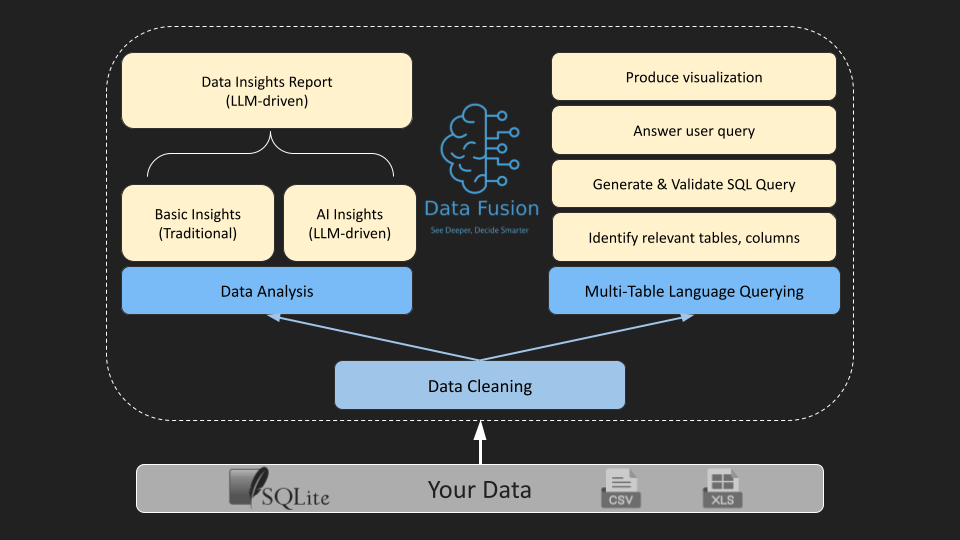

  

  

    <!--   -->
    <a href="https://data-fusion-umber.vercel.app/login">Website</a>
    ·
    <a href="./docs">Docs</a>
  

----------------------------------------
DataFusion is an innovative AI-powered platform that
transforms how businesses interact and manage data. It offers a full-fledge web-framework to manage your data, use natural language querying and visualization, and allows multi-data source interactions.

  

## Features

## Creating and running Docker Image

Building a docker image:
- Enter the repo: `cd genai-ex-datafusion`
- Run command: `docker build -t datafusion_v1 .`
 
Running a docker image: 
- Connecting with the created image `datafusion_v1`: `docker run -p 8000:8000 datafusion_v1`

Inspect: `docker run -it --entrypoint /bin/sh datafusion_firstapp`

## Access APIs
Once you run the docker image, you can access the APIs as follows:
- Open your browser and enter: `localhost:8000/docs`
- API `upload_csv`: 
    - payload: `filename: ~/datafusion/ai/data/titanic.csv`
- API `csv_interactor`: 
    - payload: `query`: your question
                `filename: ~/datafusion/ai/data/titanic.csv`